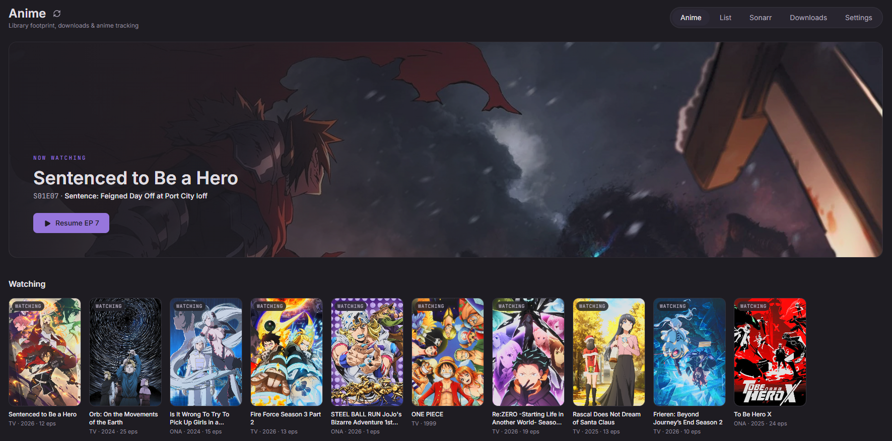

# epic self-hosting

Self-hosted anime platform: search with AniList, acquire through Sonarr, and watch via a custom Jellyfin player with client-side ASS subtitles, progress tracking, and MAL sync. The app owns your state; Jellyfin, Sonarr, and qBittorrent stay behind the scenes.

[](https://nextjs.org)
[](https://www.typescriptlang.org)
[](https://react.dev)
[](https://tailwindcss.com)
[](https://orm.drizzle.team)
[](https://vitest.dev)
[](#license)

---

## Features

- Search anime with AniList (titles, genres, covers, airing schedules)
- Add series to your download pipeline via Sonarr
- Custom persistent player: big mode + mini-player, auto-next, keyboard shortcuts, draggable seek bar
- Client-side ASS/SSA subtitles (libass via WASM) with embedded-font support and instant track switching
- Audio and subtitle track pickers; audio switches re-resolve keeping the current position
- Progress tracking with resumable positions, watched state, and per-anime history
- MyAnimeList progress sync
- Live updates via Jellyfin webhooks + Server-Sent Events
- Domain logic in plain services under `lib/services/`, tested with Vitest against a real SQLite DB; integrations behind adapter interfaces

## Preview



## Prerequisites

- Node.js 20+ and npm
- A Jellyfin server (e.g. `http://localhost:8096`) with a library pointed at your media
- Sonarr (optional, for acquisition) with its API key
- qBittorrent (optional, for the download queue)

## Installation

```bash
# 1. Clone the repository
git clone https://github.com/oddepic/epic-self-hosting.git
cd epic-self-hosting

# 2. Install dependencies
npm install

# 3. Configure environment variables
cp .env.example .env
```

### Environment variables

| Variable | Required | Purpose |
|---|---|---|
| `AUTH_PASSWORD` | yes | Password for the single local account |
| `JELLYFIN_URL` / `JELLYFIN_API_KEY` / `JELLYFIN_USER_ID` | yes | Jellyfin connection for playback and availability |
| `JELLYFIN_WEBHOOK_SECRET` | yes | Validates incoming Jellyfin webhooks |
| `JELLYFIN_SERVICE_USERNAME` / `JELLYFIN_SERVICE_PASSWORD` | yes | Service account used to resolve streams |
| `SONARR_URL` / `SONARR_API_KEY` | no | Sonarr acquisition |
| `SONARR_ROOT_FOLDER` / `SONARR_QUALITY_PROFILE_ID` | no | Download location and quality profile |
| `MAL_CLIENT_ID` / `MAL_CLIENT_SECRET` | no | MyAnimeList OAuth sync |

## Usage

```bash
npm run dev        # development server on http://localhost:3000
npm test           # run the Vitest suite
npm run lint       # ESLint
npm run build      # production build (webpack — see note below)
npm start          # start the production server
npm run db:generate  # regenerate SQLite migrations from lib/db/schema.ts
```

The SQLite database is created and migrated automatically on first run.

> Build note: use `next build --webpack`. Turbopack hangs on JASSUB's WASM/worker graph, so webpack is the supported production build.

```ts
// Play an episode by id, resuming saved progress by default
await player.play(episodeId);

// Start from the beginning regardless of saved progress
await player.play(episodeId, false);
```

## Roadmap

- Foundation, auth, search, and acquisition — done
- Jellyfin availability, webhooks, and live SSE updates — done
- Persistent player, client-side ASS subtitles, control bar — done
- Track picker UI — in progress
- Skip Intro / Credits (Intro Skipper segments)
- Multi-user support beyond the single local account
- Download queue (qBittorrent) UI

## Contributing

Contributions are welcome. Found a bug or have an idea?

1. Open an Issue describing the problem, expected behavior, and steps to reproduce.
2. Submit a Pull Request: fork the repo, create a focused feature branch, and run `npm test` and `npm run lint` before pushing. Domain logic changes should come with tests.

## License

Distributed under the [MIT License](LICENSE).
